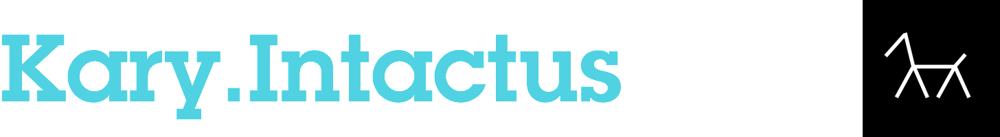
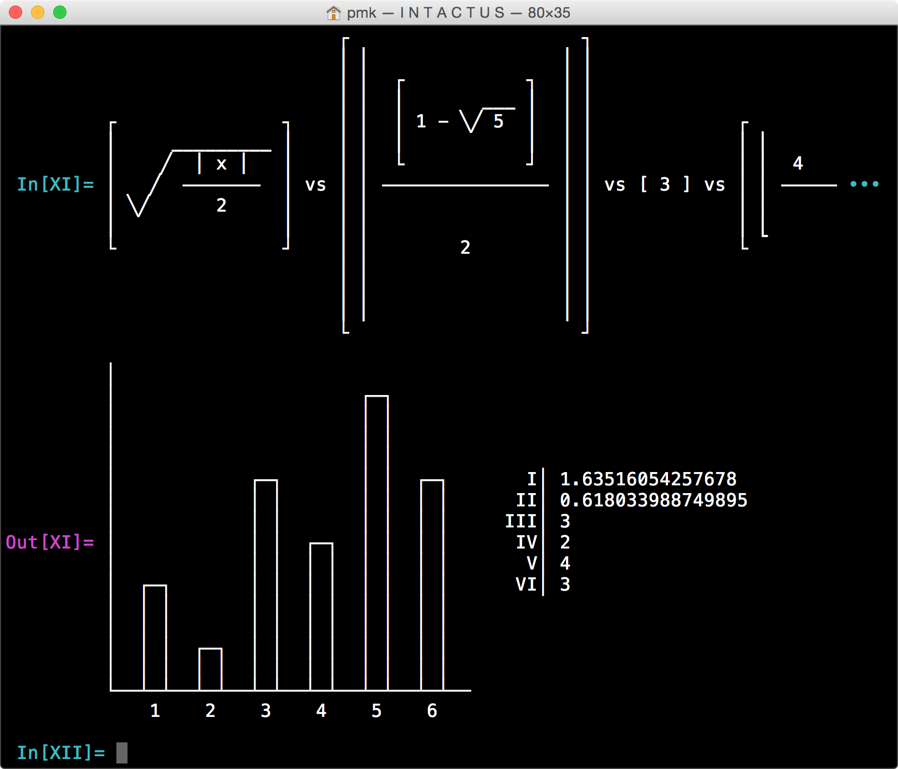

Intactus is a super lightweight kit based on the Kary Framework's Leopard text facilities that provides native "text based" ASCII art like Mathematical Notation and Chart rendering for .NET technologies.

The text rendered using Intactus is better to be displayed using `Menlo` font family. 

<br>



<br>

## API

#### Intactus.Notation

To create "Mathematical Notation" you can use this simple API


```C#
Intactus.Notation.Generate( string );
```

You feed it with a string representation of your notation and it will simply generate you an advance rendering:


```C#
string simple_notation = "sqrt( abs( -32 / 2 ) )"
string rendered_notion = Intactus.Notation.Generate(simple_notation);
```

And then the `rendered_notion` will be:

```
┌                   ┐                                                   
⎪       ___________ ⎪
⎪      ╱ ⎜       ⎟  ⎪
⎪     ╱  ⎜  -32  ⎟  ⎪
⎪    ╱   ⎜ ───── ⎟  ⎪
⎪   ╱    ⎜   2   ⎟  ⎪
⎪ ╲╱     ⎜       ⎟  ⎪
⎪                   ⎪
└                   ┘
```

<br>

#### Intactus.Charts.ColumnChart

The API lets you create a column chart with your own defined with an specified height size and using an array of numbers: 

```C#
Intactus.Charts.ColumnChart (double[] numbers, int height);
```

So for example this code:

```C#
double[] numbers = {33.5, 10, 24, 11.23, 34.32};
Intactus.Charts.ColumnChart (numbers, 15);
```

Will result:

```
│                                        
│                      ┌─┐               
│  ┌─┐                 │ │               
│  │ │                 │ │               
│  │ │                 │ │               
│  │ │                 │ │  
│  │ │       ┌─┐       │ │ 
│  │ │       │ │       │ │ 
│  │ │       │ │       │ │ 
│  │ │       │ │       │ │ 
│  │ │       │ │       │ │ 
│  │ │  ┌─┐  │ │  ┌─┐  │ │  
│  │ │  │ │  │ │  │ │  │ │               
│  │ │  │ │  │ │  │ │  │ │               
│  │ │  │ │  │ │  │ │  │ │               
└──┴─┴──┴─┴──┴─┴──┴─┴──┴─┴──
    1    2    3    4    5     
```


<br><br>

## License

```
Kary.Intactus - Advance Mathematical Notation and Chart Rendering Kit
Copyright (c) 2015 Kary Systems, Inc. All rights reserved.
Copyright (c) 2015 Pouya Kary <k@arendelle.org>


This program is free software: you can redistribute it and/or modify
it under the terms of the GNU General Public License as published by
the Free Software Foundation, either version 3 of the License, or
(at your option) any later version.

This program is distributed in the hope that it will be useful,
but WITHOUT ANY WARRANTY; without even the implied warranty of
MERCHANTABILITY or FITNESS FOR A PARTICULAR PURPOSE.  See the
GNU General Public License for more details.

You should have received a copy of the GNU General Public License
along with this program.  If not, see <http://www.gnu.org/licenses/>.
```